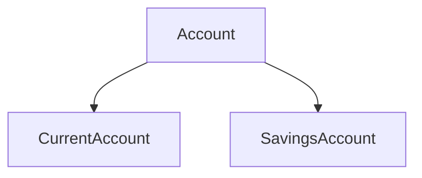

# Exercice Bank en C#

## Énoncé

### 1. Classe `Person`

Créer une classe `Person` implémentant :

- **Propriétés publiques** :
  - `string FirstName`
  - `string LastName`
  - `DateTime BirthDate`

---

### 2. Classe `CurrentAccount`

Créer une classe `CurrentAccount` qui permet la gestion d’un compte courant, implémentant :

- **Propriétés publiques** :
  - `string Number`
  - `double Balance` (lecture seule)
  - `double CreditLine`
  - `Person Owner`

- **Méthodes publiques** :
  - `void Withdraw(double amount)`
  - `void Deposit(double amount)`

---

### 3. Classe `Bank`

Créer une classe `Bank` pour gérer les comptes de la banque, implémentant :

- **Propriétés** :
  - `Dictionary<string, CurrentAccount> Accounts` (lecture seule)
  - `string Name`

- **Méthodes** :
  - `void AddAccount(CurrentAccount account)`
  - `void DeleteAccount(string number)`

---

### 4. Méthode pour retourner le solde

Ajouter une méthode qui retourne le solde d’un compte courant.

---

### 5. Somme des comptes

Permettre à la banque de donner la somme de tous les comptes d’une personne.

### 6. Classe 'SavingsAccount'

Créer une classe 'SavingsAccount' pour la gestion d'un carnet d'épargne implémentant :

- **Les propriétés publiques** :
  - `string Number`
  - `double balance` (lecture seule)
  - `DateTime DateLastWithdraw`
  - `Person Owner`

- **Les méthodes publiques** :
  - `void Withdraw` (double amount)
  - `void Deposit` (double amount)

### 7. Classe 'Account'

Définir la classe 'Account' reprenant les parties commune aux classes 'CurrentAccount' et 'SavingsAccount' en utilisant les concepts d'héritage, de redéfinition de méthodes et si besoin, de surcharge de méthodes et d'encapsulation.
Attention le niveau d'accessibilité du mutateur de la propriété Balance doit rester 'private'.

### 8. Update Classe 'Bank'

Modifier la classe 'Bank' afin qu'elle ne travaille qu'avec des comptes.
