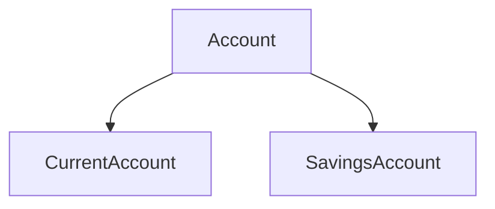

# Exercice Bank en C#

## Énoncé

### 1. Classe `Person`

Créer une classe `Person` implémentant :

- **Propriétés publiques** :
  - `string FirstName`
  - `string LastName`
  - `DateTime BirthDate`

---

### 2. Classe `CurrentAccount`

Créer une classe `CurrentAccount` qui permet la gestion d’un compte courant, implémentant :

- **Propriétés publiques** :
  - `string Number`
  - `double Balance` (lecture seule)
  - `double CreditLine`
  - `Person Owner`

- **Méthodes publiques** :
  - `void Withdraw(double amount)`
  - `void Deposit(double amount)`

---

### 3. Classe `Bank`

Créer une classe `Bank` pour gérer les comptes de la banque, implémentant :

- **Propriétés** :
  - `Dictionary<string, CurrentAccount> Accounts` (lecture seule)
  - `string Name`

- **Méthodes** :
  - `void AddAccount(CurrentAccount account)`
  - `void DeleteAccount(string number)`

---

### 4. Méthode pour retourner le solde

Ajouter une méthode qui retourne le solde d’un compte courant.

---

### 5. Somme des comptes

Permettre à la banque de donner la somme de tous les comptes d’une personne.

---

### 6. Classe 'SavingsAccount'

Créer une classe 'SavingsAccount' pour la gestion d'un carnet d'épargne implémentant :

- **Les propriétés publiques** :
  - `string Number`
  - `double balance` (lecture seule)
  - `DateTime DateLastWithdraw`
  - `Person Owner`

- **Les méthodes publiques** :
  - `void Withdraw` (double amount)
  - `void Deposit` (double amount)

---

### 7. Classe 'Account'

Définir la classe 'Account' reprenant les parties commune aux classes 'CurrentAccount' et 'SavingsAccount' en utilisant les concepts d'héritage, de redéfinition de méthodes et si besoin, de surcharge de méthodes et d'encapsulation.
Attention le niveau d'accessibilité du mutateur de la propriété Balance doit rester 'private'.

---

### 8. Update Classe 'Bank'

Modifier la classe 'Bank' afin qu'elle ne travaille qu'avec des comptes.

---

### 9. Update Classe 'Account'

Définir la classe 'Account' comme étant abstraite.

---

### 10. Update Classe 'Account'

Ajouter une méthode abstraite « protected » à la classe « Account » ayant le prototype 'double CalculInterets()' en sachant que pour un livret d’épargne le taux est toujours de 4.5% tandis que pour le compte courant si le solde est positif le taux sera de 3% sinon de 9.75%.

---

### 11. Update Classe 'Account'

Ajouter une méthode 'public' à la classe 'Account' appelée 'ApplyInterest' qui additionnera le solde avec le retour de la méthode 'CalculInterest'.

### 12. Interface 'IAccount'

Créer une interface 'IAccount' afin de limiter l'accès à consulter la propriété 'Balance' et d'utiliser les méthodes 'Deposite' et 'Withdraw'.

### 13. Interface 'IBankAccount'
Créer l'interface 'IDankAccount'ayant les mêmes fonctionnalités que 'IAccount'. Elle lui permettra, en plus, d'invoquer la méthode du 'ApplyInteret' et offrira un accès en lecture au 'Owner' et au 'Number'.

### 14. Update classe 'Account'
Ajouter a la classe 'Account', deux constructeurs prenant en paramètre :

- **Le numéro et le titulaire**

- **Le numéro, le titulaire et le solde (pour le cas d'une base de données)**

### 15. Update Classes 'Current' et 'SavingsAccount'
Ajoutez le ou les constructeurs aux classes 'Current' et 'SavingsAccount'.

### 16. Update Classes 'Person', 'Account' et 'SavingsAccount'
Changer l'encapsulation des propriétés des classes 'Person', 'Account' et 'SavingsAccount' afin de spécifier leur mutateur en 'private'.

### 17. Update bank 
Définir ce qu'il manque pour que le programme continue à tourner.

### 18. Update Classe Account
- **Au niveau de la méthode 'Deposit', déclenchez une exception de type 'ArgumentOutOfRangeException' si le montant n'est pas supérieur à 0 (zéro).**
- **Faites de même au niveau de la méthode 'Withdraw' et y ajouter le déclenchement d'une exception de type 'InsufficientBalanceException' si le montant ne peut être retiré.**

### 19. Update Classe 'Current'
Au niveau de la propriété 'CreditLine', déclenchez une exception de type 'ArgumentOutOfRangeException' si la valeur n'est pas supérieur ou égale à 0 (zéro).
